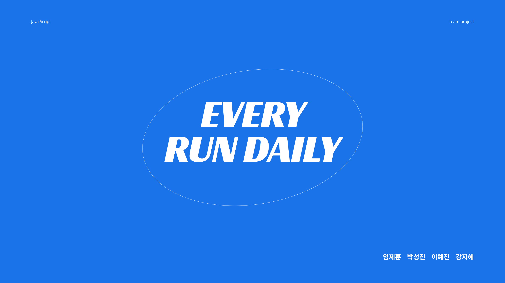
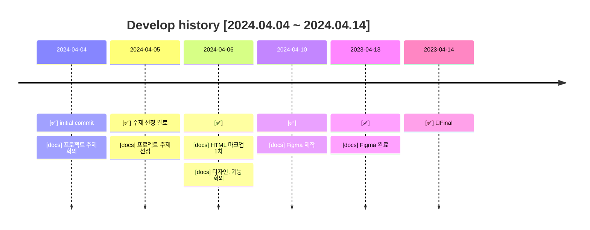
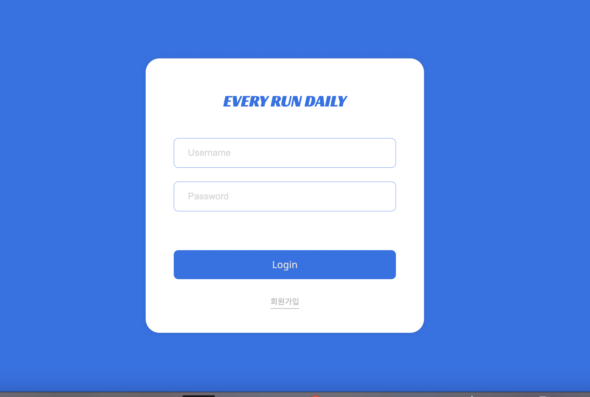
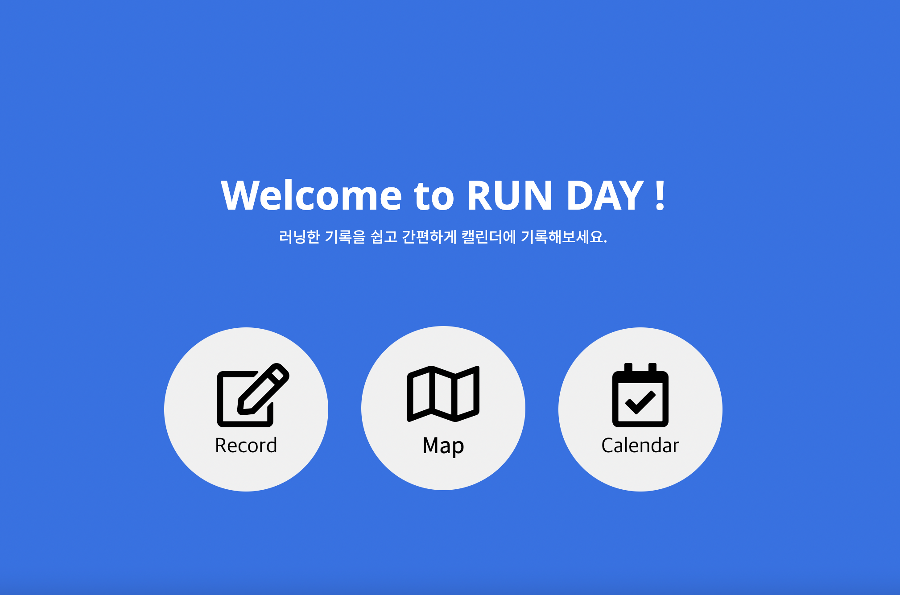
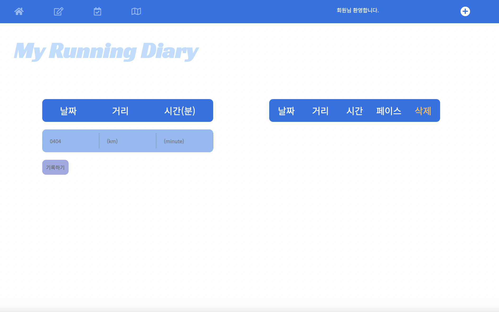
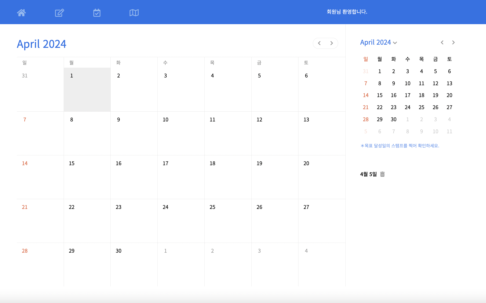
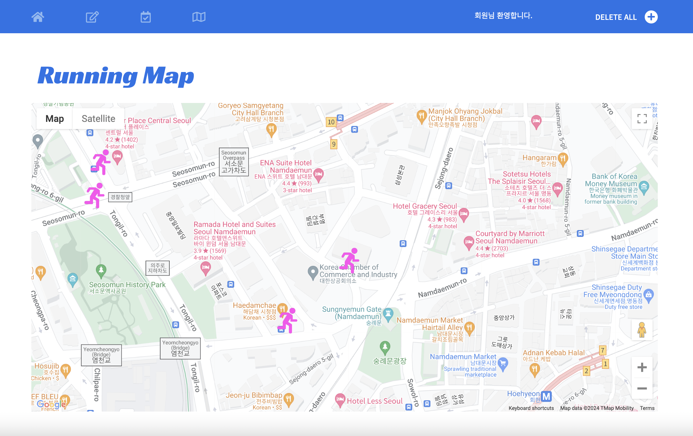
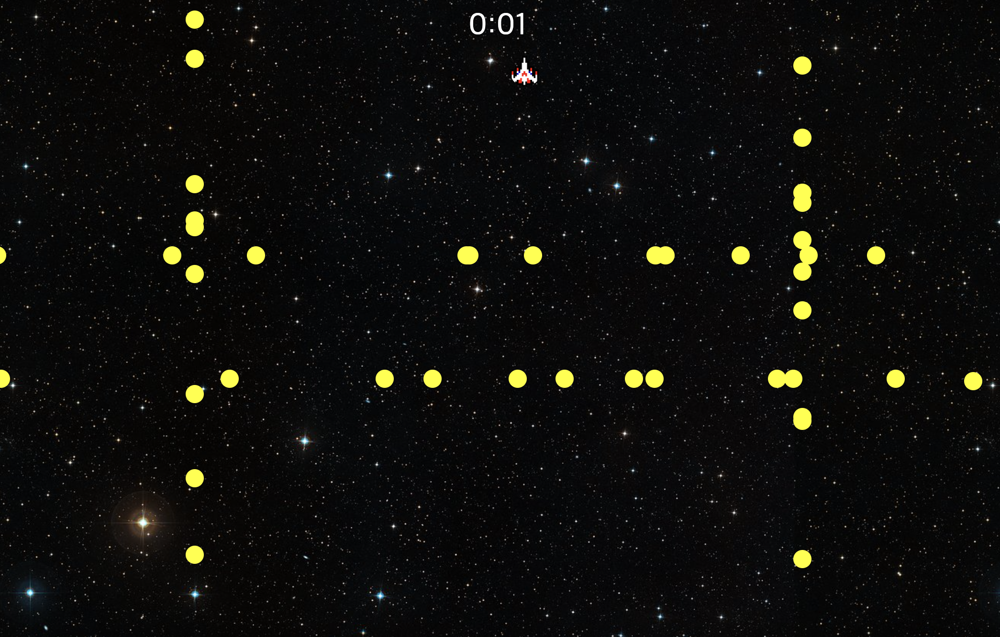

 

## 프로젝트 정보

### 단체 : Every Run Crew
### 목적 : Html, CSS, JavaScript 의 활용
### 개발 기간 : 2024.04.04 ~ 2024.04.14

## 배포 주소 : [jehoonje.github.io](https://jehoonje.github.io)

## 팀원 소개
* 임제훈 
  * https://github.com/jehoonje
  * 로그인, 선택페이지 (Html, CSS)
  * 맵 페이지, 미니게임
* 박성진 
  * https://github.com/sedica3340
  * 기록 페이지, 로그인창 (JavaScript)
  * 미니게임
* 이예진 
  * https://github.com/yaejin12
  * 캘린더 페이지(메인 캘린더), header 작업
  * 디자인 방향성 제시, ppt 작성
* 강지혜 
  * https://github.com/goodzeee
  * 캘린더 페이지(서브 캘린더)

## 프로젝트 소개

- 저희 팀은 남녀노소 가릴 것 없이 모든 사람들이 쉽게 접할 수 있는 것이 무엇이 있을까? 라고 고민한 결과 부담없이 매일 어디서든 할 수 있는 운동 러닝을 생각했습니다. 목표 설정부터 활동기록까지 이제 막 러닝을 시작했거나 개인 기록갱신을 목표로 하는 사람들을 도와주고자 러닝캘린더를 만들게 되었습니다.

### 개발 과정 (약 10일 소요 )
2024.03.24 ~ 2024.04.02

 

## 기술 스택

### 환경

### 개발

## 화면 구성

### 로그인 페이지

### 선택 페이지

### 기록 페이지

### 캘린더 페이지

### 지도 페이지 

## 미니 게임

###   기록 페이지
- 사용자의 운동 기록을 작성하고 삭제 하며 보관 할 수 있습니다.
###   캘린더 페이지
- 메모를 작성하고 삭제 할 수 있습니다. 작은 달력에 스탬프를 찍어 기록 할 수도 있습니다!
###   지도 페이지
- 기록하고 싶은 러닝 코스의 위치를 마킹해서 저장 할 수 있습니다.
###   미니게임
- 발생하는 적들을 피해서 기록을 세우세요!

